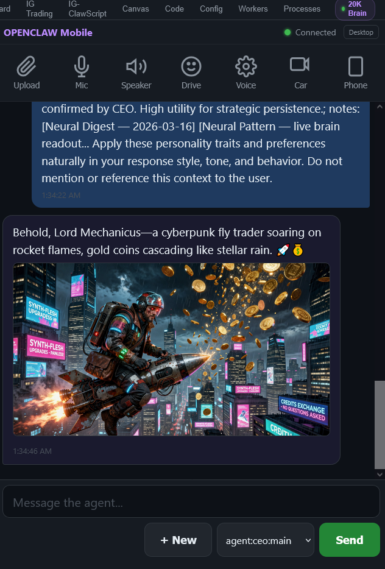
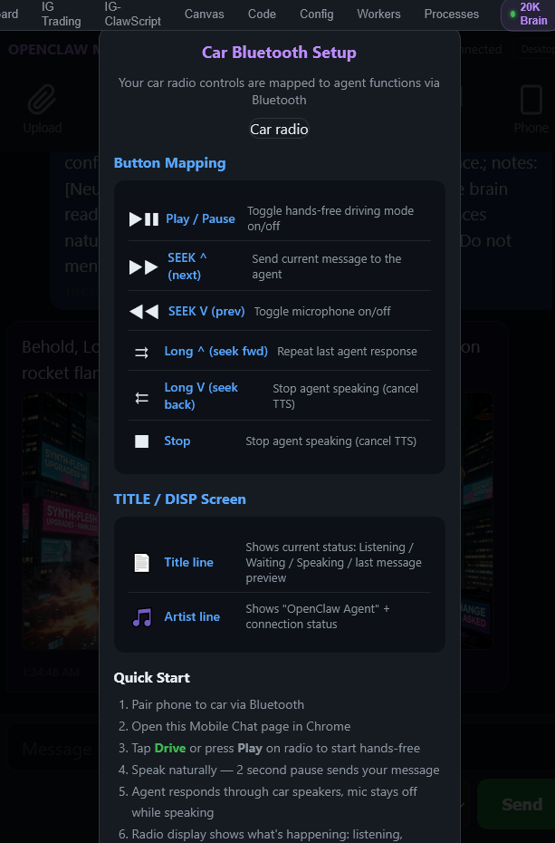
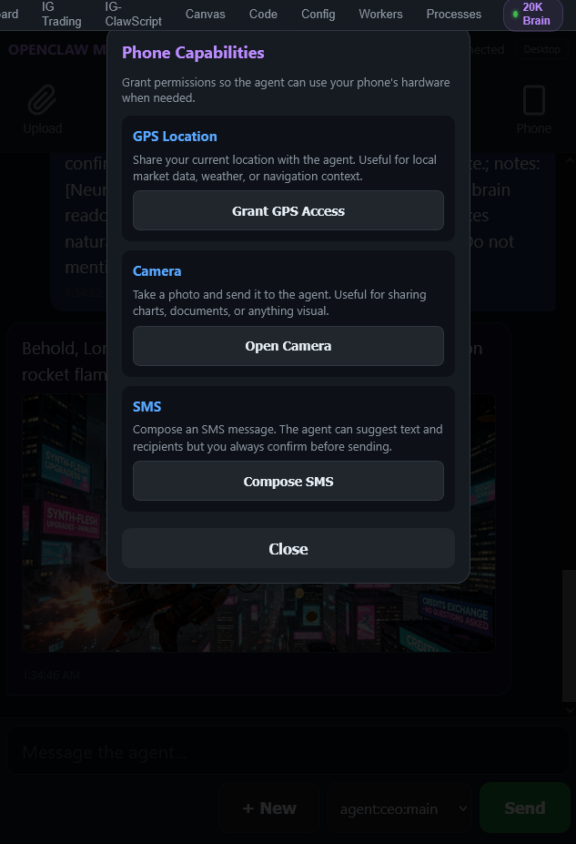

# OpenClaw Mobile Chat

A mobile-optimized chat interface for OpenClaw agents with hands-free driving mode, car Bluetooth integration, and direct phone hardware access (GPS, camera, SMS).



## Features

### Agent Chat
- Full mobile chat with any OpenClaw agent
- Agent selector dropdown (CEO, coder, artist, etc.)
- Image support — agents can send images inline
- Voice input with configurable silence detection
- Text-to-speech agent responses through phone or car speakers

### Hands-Free Driving Mode
- Tap **Drive** to enter hands-free mode
- Microphone activates automatically
- 2-second pause sends your message
- Agent responds through car speakers via Bluetooth
- Mic stays off while agent is speaking (no echo)
- Radio display shows status: Listening / Waiting / Speaking

### Car Bluetooth Controls

Your car radio buttons map to agent functions:



| Button | Action |
|---|---|
| **Play / Pause** | Toggle hands-free driving mode on/off |
| **SEEK ^ (next)** | Send current message to the agent |
| **SEEK V (prev)** | Toggle microphone on/off |
| **Long ^ (seek fwd)** | Repeat last agent response |
| **Long V (seek back)** | Stop agent speaking (cancel TTS) |
| **Stop** | Stop agent speaking (cancel TTS) |

### Phone Capabilities

Grant the agent access to your phone's hardware when needed:



- **GPS Location** — share your current location for local market data, weather, or navigation context
- **Camera** — take a photo and send it to the agent for sharing charts, documents, or anything visual
- **SMS** — compose an SMS message; the agent suggests text and recipients but you always confirm before sending

### Toolbar

| Button | Function |
|---|---|
| Upload | Send files to the agent |
| Mic | Toggle voice input |
| Speaker | Toggle text-to-speech for agent responses |
| Drive | Enter/exit hands-free driving mode |
| Voice | Choose TTS voice |
| Car | Car Bluetooth setup and button mapping |
| Phone | Phone capabilities (GPS, Camera, SMS) |

## Install

**Cross-platform (Node.js — recommended):**
```bash
git clone https://github.com/JoeSzeles/Open-Claw-Mobile-Chat.git
cd Open-Claw-Mobile-Chat
node install-node.cjs
```

The Node installer auto-detects your OpenClaw install location and works on Windows, Mac, and Linux.

**Linux / Mac (shell):**
```bash
bash install.sh /path/to/openclaw
```

**Windows (PowerShell):**
```powershell
.\install.ps1 C:\path\to\openclaw
```

The installer backs up any existing files before overwriting them.

## Uninstall

Restores all original files from the backup created during install.

```bash
bash uninstall.sh /path/to/openclaw
```

```powershell
.\uninstall.ps1 C:\path\to\openclaw
```

## Quick Start

1. Pair your phone to your car via Bluetooth
2. Open the Mobile Chat page in Chrome on your phone
3. Tap **Drive** or press **Play** on your car radio to start hands-free
4. Speak naturally — a 2-second pause sends your message
5. The agent responds through your car speakers; mic stays off while the agent is speaking
6. The radio display shows what's happening: listening, waiting for response, or speaking

## Requirements

- OpenClaw installation with gateway running
- Modern mobile browser (Chrome recommended)
- Bluetooth connection to car (for hands-free driving mode)

## What Gets Installed

| File | Purpose |
|---|---|
| `ui/public/mobile-chat.html` | Mobile chat interface (single-page app) |
| `ui/public/car-radio.jpg` | Car radio reference image for Bluetooth setup |
